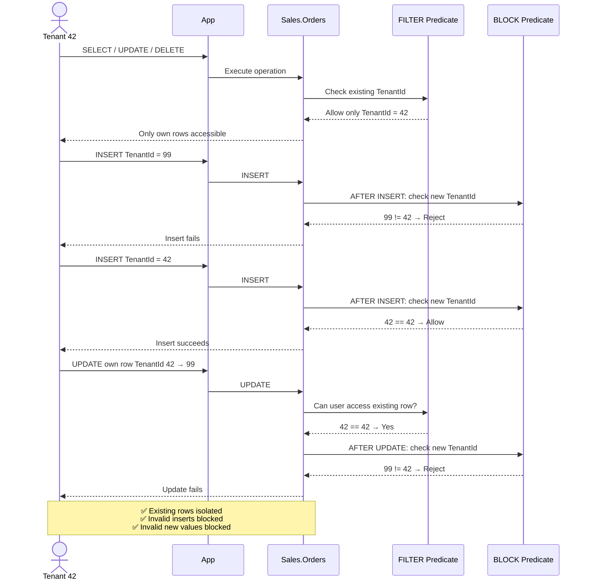
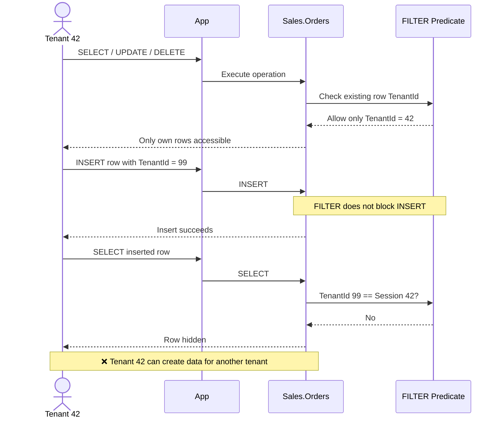
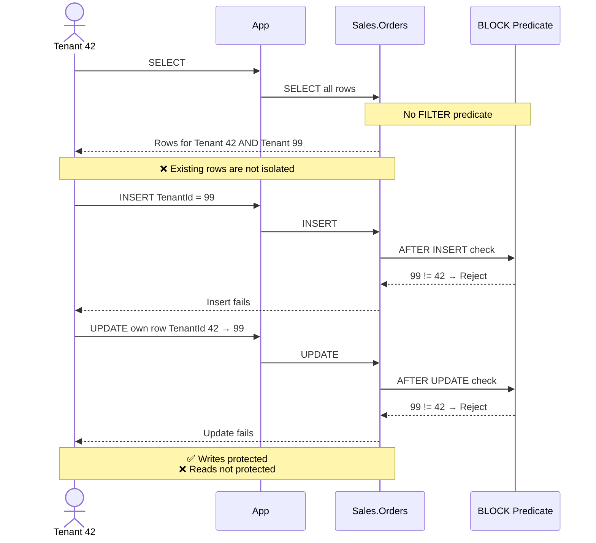
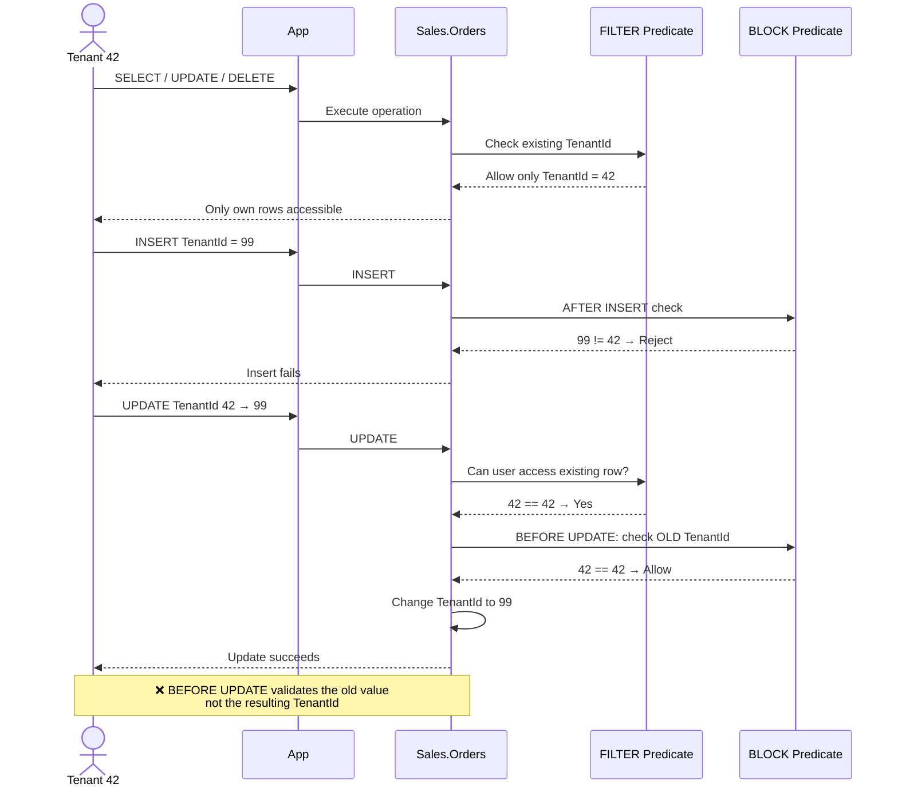

# SQL Server question — Row-Level Security 1

## Statement

An organization hosts a multi-tenant application in Azure SQL Database. All application users connect to the database through the same database principal, `AppUser`.

At the beginning of each request, the application sets the tenant ID:

```sql
EXEC sys.sp_set_session_context
    @key = N'tenant_id',
    @value = 42;
```

The following table stores orders for all tenants:

```sql
CREATE TABLE Sales.Orders
(
    OrderId   bigint NOT NULL PRIMARY KEY,
    TenantId  int NOT NULL,
    Amount    decimal(12,2) NOT NULL
);
```

You must implement security that meets these requirements:

- `SELECT` returns only rows belonging to the tenant stored in `SESSION_CONTEXT`.
- A tenant can `UPDATE` or `DELETE` only its own existing rows.
- An `INSERT` that specifies another tenant's `TenantId` must fail.
- An `UPDATE` that changes an existing row's `TenantId` to another tenant must fail.
- Enforcement must occur in the database and must not depend on application `WHERE` clauses.

You create the schema:

```sql
CREATE SCHEMA Security;
GO
```

Which implementation should you use?

### a.

```sql
CREATE FUNCTION Security.fn_TenantPredicate
(
    @TenantId int
)
RETURNS TABLE
WITH SCHEMABINDING
AS
RETURN
(
    SELECT 1 AS AccessResult
    WHERE @TenantId =
          CAST(SESSION_CONTEXT(N'tenant_id') AS int)
);
GO

CREATE SECURITY POLICY Security.TenantPolicy
ADD FILTER PREDICATE
    Security.fn_TenantPredicate(TenantId)
    ON Sales.Orders
WITH (STATE = ON);
GO
```

### b.

```sql
CREATE FUNCTION Security.fn_TenantPredicate
(
    @TenantId int
)
RETURNS TABLE
WITH SCHEMABINDING
AS
RETURN
(
    SELECT 1 AS AccessResult
    WHERE @TenantId =
          CAST(SESSION_CONTEXT(N'tenant_id') AS int)
);
GO

CREATE SECURITY POLICY Security.TenantPolicy
ADD BLOCK PREDICATE
    Security.fn_TenantPredicate(TenantId)
    ON Sales.Orders AFTER INSERT,
ADD BLOCK PREDICATE
    Security.fn_TenantPredicate(TenantId)
    ON Sales.Orders AFTER UPDATE
WITH (STATE = ON);
GO
```

### c.

```sql
CREATE FUNCTION Security.fn_TenantPredicate
(
    @TenantId int
)
RETURNS TABLE
WITH SCHEMABINDING
AS
RETURN
(
    SELECT 1 AS AccessResult
    WHERE @TenantId =
          CAST(SESSION_CONTEXT(N'tenant_id') AS int)
);
GO

CREATE SECURITY POLICY Security.TenantPolicy
ADD FILTER PREDICATE
    Security.fn_TenantPredicate(TenantId)
    ON Sales.Orders,
ADD BLOCK PREDICATE
    Security.fn_TenantPredicate(TenantId)
    ON Sales.Orders AFTER INSERT,
ADD BLOCK PREDICATE
    Security.fn_TenantPredicate(TenantId)
    ON Sales.Orders AFTER UPDATE
WITH (STATE = ON);
GO
```

### d.

```sql
CREATE FUNCTION Security.fn_TenantPredicate
(
    @TenantId int
)
RETURNS TABLE
WITH SCHEMABINDING
AS
RETURN
(
    SELECT 1 AS AccessResult
    WHERE @TenantId =
          CAST(SESSION_CONTEXT(N'tenant_id') AS int)
);
GO

CREATE SECURITY POLICY Security.TenantPolicy
ADD FILTER PREDICATE
    Security.fn_TenantPredicate(TenantId)
    ON Sales.Orders,
ADD BLOCK PREDICATE
    Security.fn_TenantPredicate(TenantId)
    ON Sales.Orders AFTER INSERT,
ADD BLOCK PREDICATE
    Security.fn_TenantPredicate(TenantId)
    ON Sales.Orders BEFORE UPDATE
WITH (STATE = ON);
GO
```

## Correct Answer

### Option C — FILTER + AFTER INSERT + AFTER UPDATE

Option c combines:

1. **FILTER PREDICATE**
   - Restricts `SELECT` to the current tenant's rows.
   - Restricts `UPDATE` and `DELETE` to the current tenant's existing rows.
2. **BLOCK PREDICATE AFTER INSERT**
   - Prevents creating rows for another tenant.
3. **BLOCK PREDICATE AFTER UPDATE**
   - Prevents modifying a row so that it belongs to another tenant.



## Explanation

### Option A — FILTER only

Option A violates both the `INSERT` requirement and the `UPDATE`-of-`TenantId` requirement.

A FILTER predicate restricts which existing rows are visible or accessible to `SELECT`, `UPDATE`, and `DELETE` operations. 

However, a FILTER predicate by itself does not prevent a user from inserting a row that belongs to another tenant. 

It also does not prevent an `UPDATE` that changes a visible row's `TenantId` to another tenant: the filter is evaluated against the existing row (which the tenant owns), the update succeeds, and the row simply disappears from the tenant's view afterwards. 



### Option B — BLOCK predicates only

Option b uses BLOCK predicates to protect `INSERT` and `UPDATE` operations, but it does not contain a FILTER predicate. As a result, it does not restrict which existing rows `AppUser` can see.



### Option D — FILTER + AFTER INSERT + BEFORE UPDATE

A `BEFORE UPDATE` block predicate evaluates the existing row before the modification. For example, assume tenant 42 owns this row:

| OrderId | TenantId | Amount |
|---|---|---|
| 1001 | 42 | 500 |

Tenant 42 attempts:

```sql
UPDATE Sales.Orders
SET TenantId = 99
WHERE OrderId = 1001;
```

A `BEFORE UPDATE` predicate evaluates the original `TenantId` value of 42, which is valid for the current tenant. It therefore does not enforce the requirement that the new `TenantId` must also belong to the current tenant.

An `AFTER UPDATE` block predicate evaluates the resulting row state. It can therefore reject the change when `TenantId` becomes 99.




---
